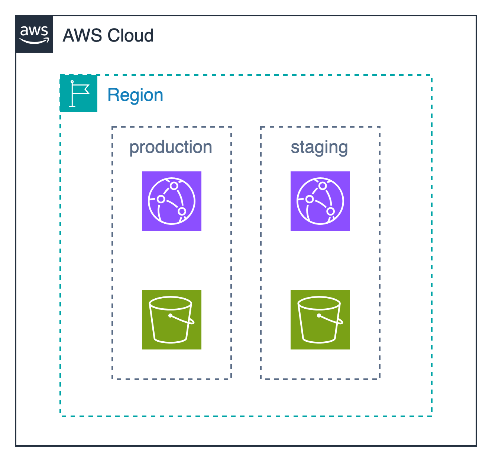

## Terraform Structure Example

Terraform のプロジェクト構成についての例を示します。
構成はシンプルに `CloudFront` と `S3` の 2 つの環境を作成するものとします。
また環境は 本番環境とステージング環境の 2 つを想定します。

- 単一 state に全環境を含むパターン - [samples/one-stack-with-all-the-environments](./samples/one-stack-with-all-the-environments/README.md)
