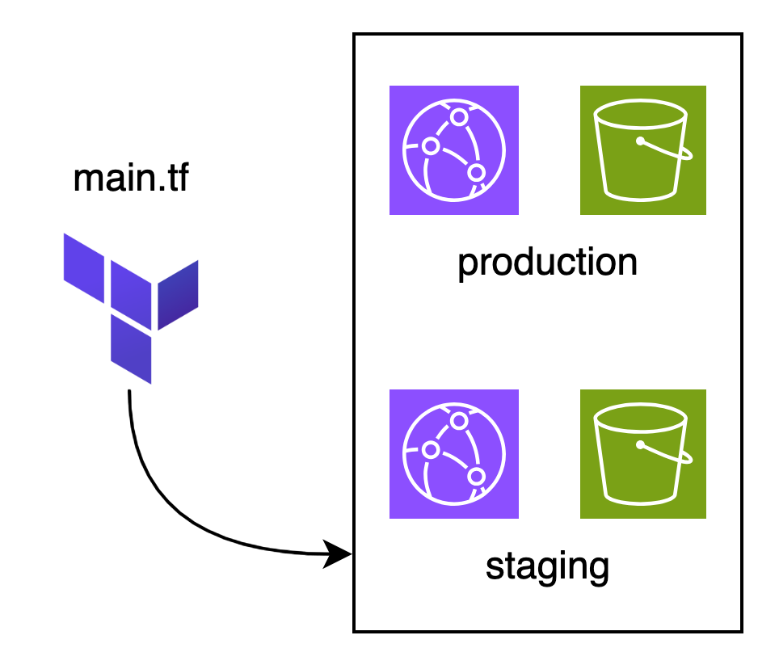
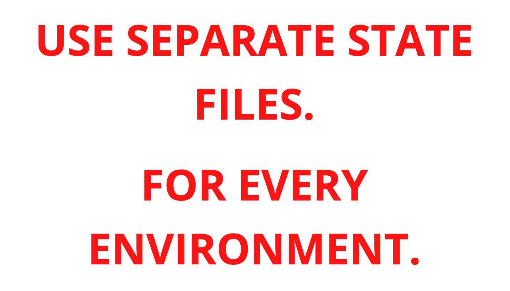

# 単一 State で全環境を管理するパターン

## 概要

この例では、単一の Terraform state で production 環境と staging 環境を管理しています。  
詳細は [main.tf](./main.tf) を参照してください。



### 問題点

全ての環境のリソースが単一の state で管理されていることは、一見便利に思えますが、以下のようなデメリットがあります：

- 環境ごとにリソースを分離できないため、誤って本番環境のリソースを変更・削除してしまうリスクがあります
- state ファイルが大きくなり、プロビジョニングや変更の適用に時間がかかります
- チームでの作業時にコンフリクトが発生しやすくなります

### 推奨アプローチ

そのため、モジュールと環境ごとにファイルを分離することが推奨されます。



> 引用元: https://charity.wtf/2016/03/30/terraform-vpc-and-why-you-want-a-tfstate-file-per-env/

## 使用方法

### 1. バックエンドバケットの作成

```sh
# バケット名を設定（一意の名前に変更してください）
BUCKET_NAME="your-unique-bucket-name"

aws s3 mb s3://$BUCKET_NAME
cat > backend.tfvars << EOF
bucket = "$BUCKET_NAME"
EOF
```

### 2. Terraform の初期化

```sh
terraform init -backend-config=backend.tfvars
```

### 3. Plan の実行

```sh
terraform plan
```

### 4. Apply の実行

```sh
terraform apply
```
