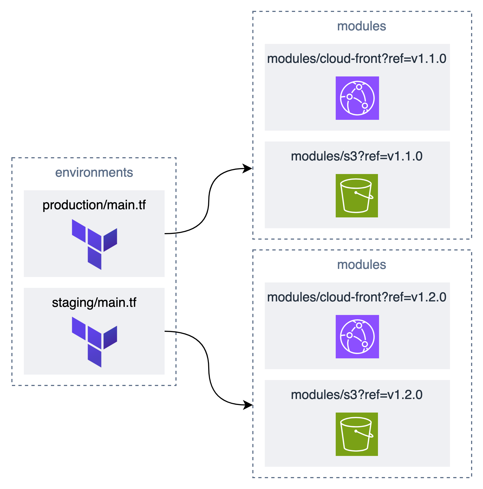

# モジュールバージョニングを使用した環境分離パターン

## 概要

基本的な構成は [samples/separate-stack-definition-for-each-environment](../separate-stack-definition-for-each-environment/README.md) と同じですが、Terraform module の source にバージョニングを追加しています。

> 参考: https://developer.hashicorp.com/terraform/language/modules/sources#github

### メリット

この手法を活用することで、module のバージョンを明示的に指定できるため、module の変更が意図しない影響を与えるリスクを軽減できます。

例えば下図のように、staging 環境では v1.2.0 を使用し、production 環境では v1.1.0 を使用することが可能です。

