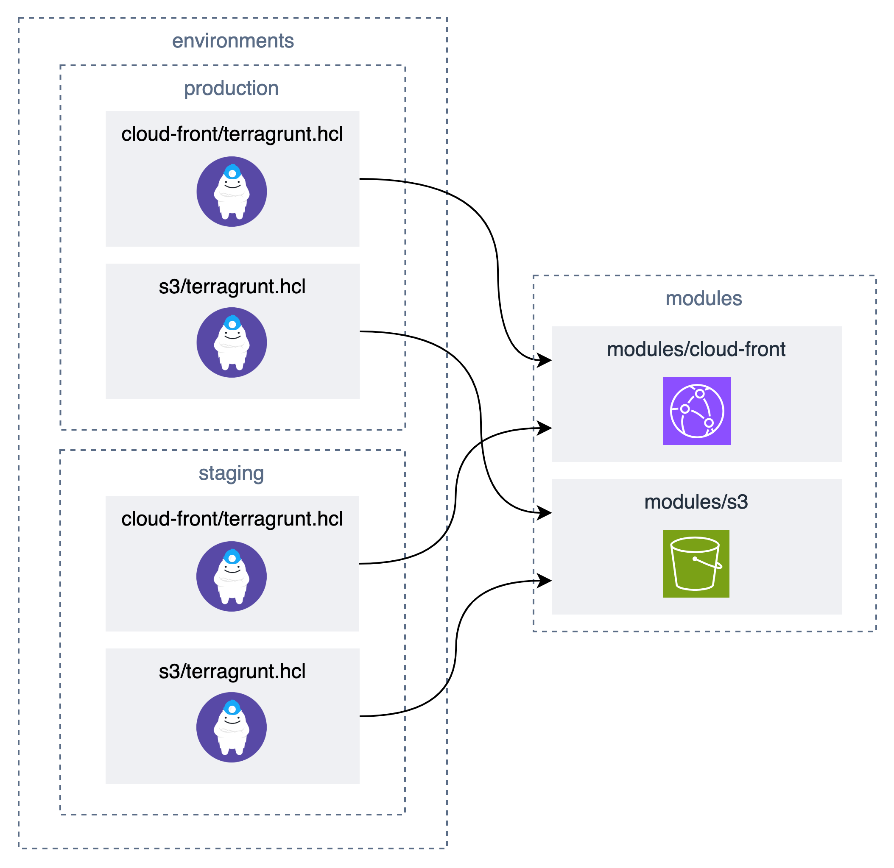

# Terragrunt を使用した環境・モジュール分離パターン

## 概要

このディレクトリは、Terragrunt を使用して環境ごと・モジュールごとに Terraform state を分離して管理する例です。
目的は、state の肥大化を防ぎつつ、環境追加やモジュール単位のデプロイを容易にすることです。

### ディレクトリ構成例

```
├── production
│   ├── cloud-front
│   │   └── terragrunt.hcl
│   ├── env.hcl
│   └── s3
│       └── terragrunt.hcl
└── staging
    ├── cloud-front
    │   └── terragrunt.hcl
    ├── env.hcl
    └── s3
        └── terragrunt.hcl
```



### 主なメリット

- 環境・モジュールごとに state を分離できるため、state の肥大化によるパフォーマンス低下を抑えられます
- `dependency` 機能を使うことで、モジュール間の依存関係を明確に定義できます

### その他の特徴

- Backend となる S3 バケットの構築も自動で行うことが可能です（初期開発時のメリット）

  - ※ 使用方法に S3 バケットの作成手順がないのはそのためです

- `generate` 機能を使うことで、`provider`や `backend` の設定を共通化できます

- 開発時は `--source` オプションでモジュールの一時切り替えも可能です
  - GitHub からではなくローカルパスを指定してモジュールを利用できます

> 参考: https://terragrunt.gruntwork.io/docs/features/units/#terragrunt-caching

## 使用方法

### Staging 環境での実行例

> **注意**: ハンズオンのため `TG_BUCKET_SUFFIX` のような suffix を付与していますが、実際の運用では冪等性を担保するためハードコードすることを推奨します。

#### 1. Plan の実行

```sh
cd environments/staging
TG_BUCKET_SUFFIX=20250831 terragrunt plan --all
```

#### 2. Apply の実行

```sh
TG_BUCKET_SUFFIX=20250831 terragrunt apply --all
```

#### 3. モジュール単体の更新

特定のモジュールのみを更新する場合：

```sh
cd environments/staging/s3
TG_BUCKET_SUFFIX=20250831 terragrunt apply
```

## 新規環境の追加方法

### 手順

#### 1. 既存環境のコピー

既存環境をベースに新しい環境ディレクトリを作成します：

```sh
cp -r environments/staging environments/your-new-environment
```

#### 2. 環境設定の編集

`env.hcl` を編集して環境名などを設定します：

```hcl
locals {
    env = "your-new-environment"
}
```

#### 3. 新環境での実行

新環境で apply を実行します：

```sh
cd environments/your-new-environment
TG_BUCKET_SUFFIX=20250831 terragrunt apply --all
```
