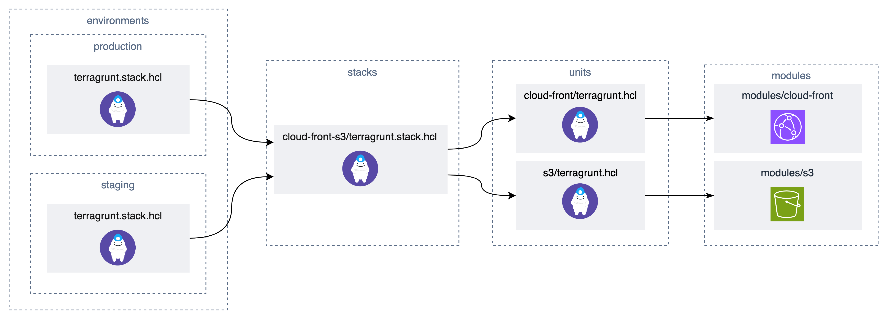

## Description

このディレクトリは Terragrunt の `stack` 機能を使って、環境・モジュールごとに Terraform state を分離しつつ、DRY に管理するためのサンプルです。

用語

- Unit: 単一のデプロイ単位で、直接 Terraform モジュールを参照します。
- Stack: 複数の Unit（や他の Stack）を組み合わせ、インフラのサブセット（例: CloudFront + S3）を定義します。
  ディレクトリ構成:例

```
.
├── environments
│   ├── production
│   │   └── terragrunt.stack.hcl
│   └── staging
│       └── terragrunt.stack.hcl
├── root.hcl
├── stacks
│   └── cloud-front-s3-service
│       └── terragrunt.stack.hcl
└── units
    ├── cloud-front
    │   └── terragrunt.hcl
    └── s3
        └── terragrunt.hcl
```



主なメリット

- 事前に Stack を定義しておけば、環境ごとに同じ構成を簡単に適用できます。
- モジュールの組み合わせを Stack 化することで、よく使うパターン（例: CloudFront + S3）を再利用できます。

---

## 使い方（staging の例）

※ハンズオンのため、TG_BUCKET_SUFFIX のような suffix を付与していますが、実際の運用では冪等性担保のためハードコードしてください。

1. plan 実行

```sh
cd environments/staging
TG_BUCKET_SUFFIX=20250831 terragrunt stack run plan
```

2. apply 実行

```sh
TG_BUCKET_SUFFIX=20250831 terragrunt stack run apply
```

モジュール単体を更新する場合（生成されたスタックを操作）:

```sh
TG_BUCKET_SUFFIX=20250831 terragrunt generate
cd .terragrunt-stack/staging/cloud-front
terragrunt apply
```

---

## How to add a new environment

1. 既存の環境をコピーして新しいディレクトリを作成します。

```sh
cp -r environments/staging environments/your-new-environment
```

2. `environments/your-new-environment/terragrunt.stack.hcl` を編集し、`path` や `values` を環境に合わせて修正します。

3. 新環境で plan/apply を実行します。

```sh
cd environments/your-new-environment
TG_BUCKET_SUFFIX=20250831 terragrunt stack run plan
TG_BUCKET_SUFFIX=20250831 terragrunt stack run apply
```
